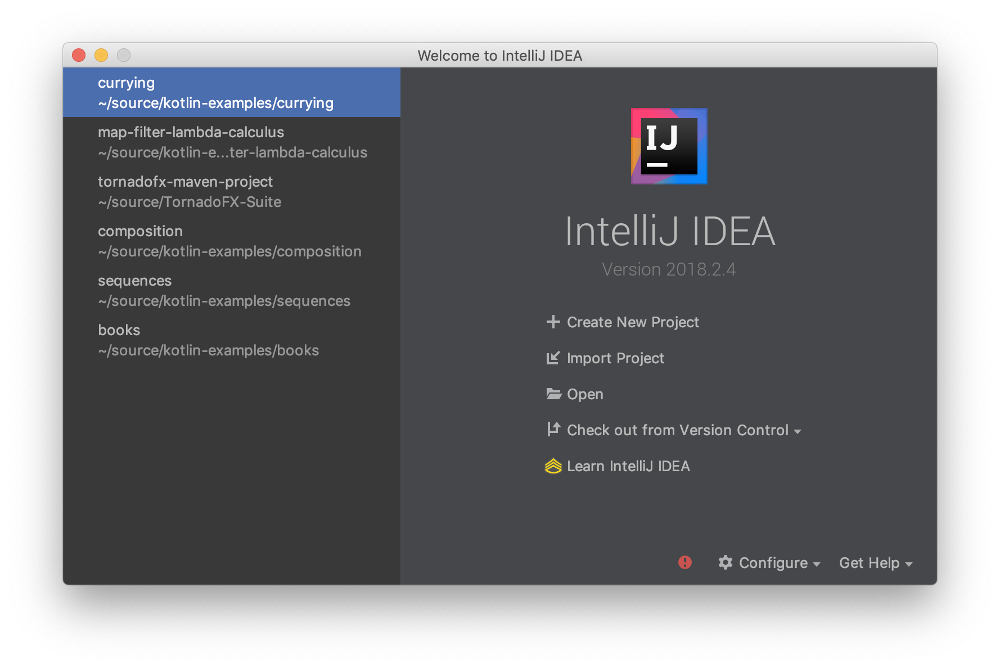

# Introduction to Functional Programming in Kotlin

## Topics:

- What is functional programming?
- Setting up my computer
- Creating a project
- Mutable vs Immutable Data (Variables vs Values)
- Functions
- Higher Order Functions
- Lambdas
- Folding functions: Map

## What is functional programming?

Coming up with a clear definition for functional programming is difficult. Functional programming is a style of programming that is inspired by two branches of mathematics: lambda calculus and category theory. But don't worry! You do not have to be a mathematician to do functional programming. There are simply certain mathematical concepts that folks have been inspired by and applied to the world of programming. That's all! Our focus in this series is to examine the practical side of these approaches. Where I think it merits introducing mathematical theory, I will provide a section for the theory and draw attention to it. Please feel free to skip over the math theory if you find it uninteresting. For those that are interested, this may give you a deeper understanding of how mathematics inspired these functional principles.

Some programming languages support a functional style better than others. On the extremely "pure" end of the spectrum, we have languages like Haskell, OCAML and others. On the "non-functional" end of the spectrum there are languages like C, C++, Golang and other similar C-inspired languages that do not support functional programming very well at all. Somewhere in the middle we have languages like Kotlin, Scala and Ruby that have very good support for functional programming but also support object-oriented programming.

As I mentioned earlier, defining functional programming is difficult, but there does seem to be some general agreement that it at least contains these three pillars:

1. Immutable data (values instead of variables)
1. Higher order functions without side effects
1. Metaprogramming

For now, I will go step by step through the first two pillars. We are not going to examine metaprogramming just yet, as that is a more complex topic that will require us to know a few things beforehand. I mention it here only for completeness.

## Setup

Before we can begin working with Kotlin, let's setup our computer. If you're on macOS, the easiest way to do this is using Homebrew. To install homebrew, follow the directions on [brew.sh](http://brew.sh).

Next, you will need to install the Kotlin compiler. Open your terminal and run the following command:

```shell
brew install kotlin
```

When writing your Kotlin code, you can use a text editor if you want. However, we can also install Intellij, which is an "Integrated Development Environment". This will make it easier to create new Kotlin projects and it will help with writing and running our code. On macOS, you can install it with this command:

```shell
brew cask install intellij-idea-ce
```

Once Intellij is installed, we're ready to get started. Open Intellij and you will then be presented with this dialog:



## Mutable vs Immutable Data: Variables vs Values

### Mutable Data (Variables)

Let's talk about the first pillar, immutable data. What does this mean? In Kotlin, we can create a variable `x` and assign the number 5 to it:

```kotlin
var x = 5
```

Now let's change the value of x to 6:

```kotlin
x = 6
```

Now x contains 6. The word "mutable" means the variable x can be changed after it's already been set. In this case, x is first set to 5, then we changed it to 6.

### Immutable Data (Values)

So far we've used the Kotlin keyword `var`. This allows us to change variables whenever we want. However, there's another keyword Kotlin has, `val`. The `val` keyword lets us .

```kotlin
val x = 5
x = 6
```

The compiler will throw an error:

```kotlin
error: val cannot be reassigned
--x
  ^
```

When using the `var` keyword, we are creating a variable. By using the `val` keyword we instead create a value. In Kotlin this means we cannot change the value anymore. Mutable means that when we create x, we cannot change it. Doesn't that sound bad? Why would we want to do this?

## Math Theory

Functional programming has its roots in mathematics. There is a law in mathematics called the law of identity. The law of identity states that a thing is whatever it is identified as and cannot be something else. This is an important law that we can apply in functional programming with Kotlin.

When programs become large (and useful programs tend to become quite large) it becomes more difficult to reason about what the program is doing when we're trying to read it, perhaps when trying to debug it or understand it so we can make a change to it. One of the goals of functional programming is to reduce the complexity of our code so it becomes easier to reason about. The first way to do this is by making use of the law of identity. If we make x mutable (changeable), we have to keep track of every change to x in our program, and there are a lot of of possible changes x can go through.

If we make x a value, and therefore immutable, we no longer have to keep track of what changes are made to x. This means that when we're looking at what the value x is thousands of lines of code into a program, we can rest assured that x is, and can only be, what it was originally defined as.

But if we have no way to change the value x, isn't our program useless? The simple answer is yes. Without the ability to change x, we can't do anything particularly useful or valuable. However, if we introduce higher order functions&mdash;the second pillar to functional programming&mdash;we can get around this limitation while still making code that is easy to think about.

So we've learned that Kotlin allows us to make variables, which can be changed anywhere later in our program. We've also learned that makes our programs difficult to reason about because we then have to think about all those changes. Finally, we learned that by making our variables into values, they cannot be changed anymore and we can then rest assured knowing that our value isn't being changed in any unexpected ways. In the next episode I'll cover higher-order functions and, in particular, we'll begin to investigate a special class of functions called folding functions.
